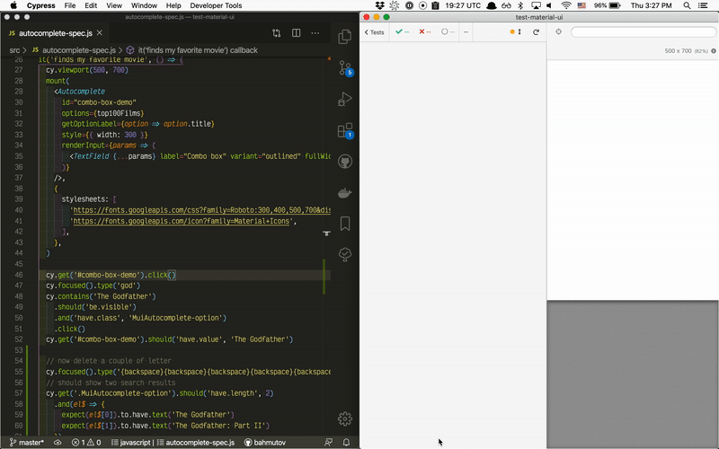
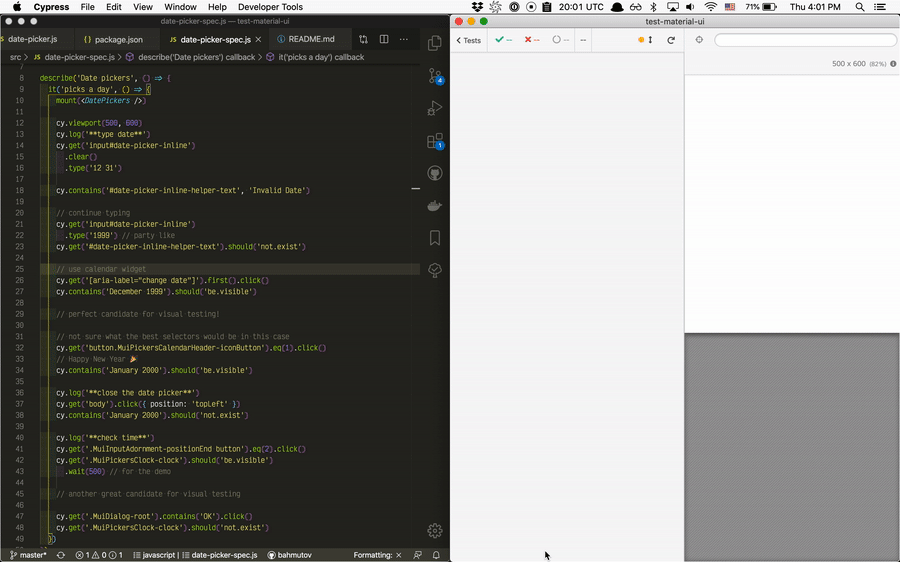

# test-material-ui
> Testing [Material UI](https://material-ui.com/) components using Cypress

Uses [cypress-react-unit-test v2](https://github.com/bahmutov/cypress-react-unit-test/pull/108)

Installation

```shell
$ npx create-react-app test-material-ui
$ cd test-material-ui

$ yarn add @material-ui/core @material-ui/icons @material-ui/lab
info Direct dependencies
├─ @material-ui/core@4.9.9
├─ @material-ui/icons@4.9.1
└─ @material-ui/lab@4.0.0-alpha.48

$ yarn add -D cypress-react-unit-test@3.0.0-cypress-mount-mode.14
```

Add [cypress.json](cypress.json) with experimental flag

Write components and specs in [src](src) folder. I recommend looking at [src/autocomplete-spec.js](src/autocomplete-spec.js)



And [src/date-picker-spec.js](src/date-picker-spec.js)


